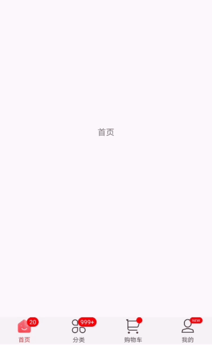

[英文(English)](https://github.com/chaychan/BottomBarLayout/blob/master/README-en.md)

### 支持

 如果觉得我的项目对你有所帮助的话，帮我点下**Star** 吧，让更多人的人可以看到，谢谢！

### 2020-11-21

 感谢各位小伙伴的支持和star，已经接近2年没有维护这个项目了，今天抽空将项目完善了一下，看到有不少小伙伴提issue，star数也已经破800了，很希望这能成为我第二个破1K的项目，我会继续维护下去，满足更多开发中的需求。 也希望有好的意见的小伙伴提issue，有能力帮忙解决出现的问题的，可以Pull Request，优秀的项目需要更多人的力量，希望各位可以一同参与进来。		

### 轻量级的底部导航栏
&emsp;&emsp;目前市场上的App，几乎都有底部页签导航栏，所以我们在开发的时候经常需要用到这个，虽然github上有不少已经封装好的底部导航栏的工具，例如bottombar,alphaIndicator(仿微信滑动渐变底部控件)等，但是这些控件由于功能太多，而且也没有给予详细的介绍文档，所以用起来不是特别容易，有时候我们仅仅只是想要一个简简单单的底部导航，但是又不想去自己在布局中搞一个个LinearLayout或者RadioGroup，然后切换页签的时候更换图标，让ViewPager跳转到对应的页面等一系列繁琐的操作，这时候，你可以使用BottomBarLayout，简简单单就可以实现以下效果：

### 我的博客

[http://chaychan.tech](http://chaychan.tech)

#### 下载体验

[点击下载体验](https://raw.githubusercontent.com/chaychan/BottomBarLayout/master/apk/demo.apk)

扫码下载：

#### **导入方式**

在项目根目录下的build.gradle中的allprojects{}中，添加jitpack仓库地址，如下：

    allprojects {
	    repositories {
	        jcenter()
	        maven { url 'https://jitpack.io' }//添加jitpack仓库地址
	    }
	}
 
打开app的module中的build.gradle，在dependencies{}中，添加依赖，如下：

    dependencies {
	        compile 'com.github.chaychan:BottomBarLayout:2.0.1' //建议使用最新版本
	}

最新发布的版本可以查看 

[https://github.com/chaychan/BottomBarLayout/releases](https://github.com/chaychan/BottomBarLayout/releases)

#### 显示未读数、提示小红点、提示消息

#### 支持lottie

### V2.0.0版本更新说明 (2020-11-21)

- 迁移至AndroidX
- 支持lottie

### V1.2.0版本更新说明 (2018-12-13)

- 支持动态添加、移除条目

### V1.1.2版本更新说明（2018-03-20）

- 添加修改未读数字体颜色和背景的属性

- 添加修改提示文字字体颜色和背景的属性

- 添加修改提示点背景的属性

### V1.1.1版本更新说明（2018-02-27）

- 修复一定要设置ViewPager的问题，修改成可设置或不设置；

- 修改点击回调，回调多一个previousPosition（上个页签的位置）

- 添加两种使用方式的demo演示

### V1.0.7版本更新说明（2018-01-05）

- 增加未读数阈值属性和设置是否平滑切换的属性；

- 去除oriention的限制。

### V1.0.6版本更新说明（2017-12-19）

- 添加滑动监听，回调onItemSelected()

### V1.0.4版本更新说明（2017-10-10）

- 增加未读数、提示小红点、提示消息的功能

### BottomBarLayout的使用

#### BottomBarItem属性介绍

        <!--默认状态下的图标-->
        <attr name="iconNormal" format="reference"/>
        <!--选中状态下的图标-->
        <attr name="iconSelected" format="reference"/>

        <!--底部文字-->
        <attr name="itemText" format="string"/>
        <!--文字大小-->
        <attr name="itemTextSize" format="dimension"/>
        <!--默认状态下的文字颜色-->
        <attr name="textColorNormal" format="color"/>
        <!--选中状态下的文字颜色-->
        <attr name="textColorSelected" format="color"/>

        <!--文字和图标的顶部距离-->
        <attr name="itemMarginTop" format="dimension"/>

        <!--是否开启触摸背景效果-->
        <attr name="openTouchBg" format="boolean"/>
        <!--设置触摸背景-->
        <attr name="touchDrawable" format="reference"/>

        <!--设置图标的宽度-->
        <attr name="iconWidth" format="dimension"/>
        <!--设置图标的高度-->
        <attr name="iconHeight" format="dimension"/>

        <!--设置BottomBarItem的padding-->
        <attr name="itemPadding" format="dimension"/>

        <!--设置未读数字体大小-->
        <attr name="unreadTextSize" format="dimension"/>
        <!--设置未读数字体颜色-->
        <attr name="unreadTextColor" format="reference"/>
        <!--设置未读数背景色-->
        <attr name="unreadTextBg" format="reference"/>

        <!--设置提示消息字体大小-->
        <attr name="msgTextSize" format="dimension"/>
        <!--设置提示消息字体颜色-->
        <attr name="msgTextColor" format="reference"/>
        <!--设置提示消息背景-->
        <attr name="msgTextBg" format="reference"/>

        <!--设置提示点背景-->
        <attr name="notifyPointBg" format="reference"/>

        <!--设置未读数组阈值 大于阈值的数字将显示为 n+ n为设置的阈值-->
        <attr name="unreadThreshold" format="integer"/>

#### 布局文件中配置

在xml文件中，配置BottomBarLayout，包裹子条目BottomBarItem
    
    <?xml version="1.0" encoding="utf-8"?>
	<LinearLayout
	    xmlns:android="http://schemas.android.com/apk/res/android"
	    xmlns:app="http://schemas.android.com/apk/res-auto"
	    android:layout_width="match_parent"
	    android:layout_height="match_parent"
	    android:orientation="vertical"
    >

    <android.support.v4.view.ViewPager
        android:id="@+id/vp_content"
        android:layout_width="match_parent"
        android:layout_height="0dp"
        android:layout_weight="1"
        ></android.support.v4.view.ViewPager>

    <com.chaychan.library.BottomBarLayout
        android:id="@+id/bbl"
        android:layout_width="match_parent"
        android:layout_height="45dp"
        android:orientation="horizontal"
        android:gravity="center"
        android:layout_gravity="center"
        android:background="@color/tab_gb"
        >

        <com.chaychan.library.BottomBarItem
            android:layout_width="0dp"
            android:layout_weight="1"
            android:layout_height="match_parent"
            app:iconNormal="@mipmap/tab_home_normal"
            app:iconSelected="@mipmap/tab_home_selected"
            app:itemText="首页"
            app:textColorNormal="@color/tab_normal_color"
            app:textColorSelected="@color/tab_selected_color"
            app:itemTextSize="8sp"
            app:itemMarginTop="-5dp"
            />

        <com.chaychan.library.BottomBarItem
            android:layout_width="0dp"
            android:layout_weight="1"
            android:layout_height="match_parent"
            app:iconNormal="@mipmap/tab_video_normal"
            app:iconSelected="@mipmap/tab_video_selected"
            app:itemText="视频"
            app:textColorNormal="@color/tab_normal_color"
            app:textColorSelected="@color/tab_selected_color"
            app:itemTextSize="8sp"
            app:itemMarginTop="-5dp"
            />

        <com.chaychan.library.BottomBarItem
            android:layout_width="0dp"
            android:layout_weight="1"
            android:layout_height="match_parent"
            app:iconNormal="@mipmap/tab_micro_normal"
            app:iconSelected="@mipmap/tab_micro_selected"
            app:itemText="微头条"
            app:textColorNormal="@color/tab_normal_color"
            app:textColorSelected="@color/tab_selected_color"
            app:itemTextSize="8sp"
            app:itemMarginTop="-5dp"
            />

        <com.chaychan.library.BottomBarItem
            android:layout_width="0dp"
            android:layout_weight="1"
            android:layout_height="match_parent"
            app:iconNormal="@mipmap/tab_me_normal"
            app:iconSelected="@mipmap/tab_me_selected"
            app:itemText="我的"
            app:textColorNormal="@color/tab_normal_color"
            app:textColorSelected="@color/tab_selected_color"
            app:itemTextSize="8sp"
            app:itemMarginTop="-5dp"
            />

      </com.chaychan.library.BottomBarLayout>

	</LinearLayout>

#### java文件中设置

找过对应的ViewPager和BottomBarLayout,为ViewPager设置Adapter，然后为BottomBarLayout设置ViewPager
     
	  mVpContent.setAdapter(new MyAdapter(getSupportFragmentManager()));
      mBottomBarLayout.setViewPager(mVpContent);

这样就实现底部导航栏功能了

#### 动态添加条目

     for (int i = 0; i < mTitleIds.length; i++) {
            //创建item
            BottomBarItem item = createBottomBarItem(i);
            mBottomBarLayout.addItem(item); //添加条目

            TabFragment homeFragment = createFragment(mTitleIds[i]);
            mFragmentList.add(homeFragment);
    }

	 private BottomBarItem createBottomBarItem(int i) {
        BottomBarItem item = new BottomBarItem.Builder(this)
                .titleTextSize(8)
                .titleNormalColor(R.color.tab_normal_color)
                .titleSelectedColor(R.color.tab_selected_color)
	//          .openTouchBg(false)
	//          .marginTop(5)
	//          .itemPadding(5)
	//          .unreadNumThreshold(99)
	//          .unreadTextColor(R.color.white)

                //还有很多属性，详情请查看Builder里面的方法
                .create(mNormalIconIds[i], mSelectedIconIds[i], getString(mTitleIds[i]));
        return item;
    }

#### 移除条目

     mBottomBarLayout.removeItem(0);

#### 开启滑动效果

页签之间的切换默认关闭了滑动效果，如果需要开启可以通过调用BottomBarLayout的setSmoothScroll()方法:

    mBottomBarLayout.setSmoothScroll(true);

也可以在布局文件中指定BottomBarLayout的smoothScroll属性为true

开启后效果如下:

#### 设置条目选中的监听

     mBottomBarLayout.setOnItemSelectedListener(new BottomBarLayout.OnItemSelectedListener() {
            @Override
            public void onItemSelected(final BottomBarItem bottomBarItem, int position) {
                   //do something
            }
        });

#### 显示未读数、提示小红点、提示消息

	mBottomBarLayout.setUnread(0,20);//设置第一个页签的未读数为20
    mBottomBarLayout.setUnread(1,101);//设置第二个页签的未读数
    mBottomBarLayout.showNotify(2);//设置第三个页签显示提示的小红点
    mBottomBarLayout.setMsg(3,"NEW");//设置第四个页签显示NEW提示文字

当设置的未读数小于或等于0时，消失未读数的小红点将会消失；  
当未读数为1-99时，则显示对应的数字；  
当未读数大于99时，显示99+；  

#### 设置未读数阈值
&emsp;&emsp; 未读数的阈值可以指定BottomBarItem的unreadThreshold属性设置，默认该值为99，如设置  app:unreadThreshold="999" ,	若未读数超过该值，则显示"999+"。

#### 隐藏提示小红点、提示消息

	mBottomBarLayout.hideNotify(2);//隐藏第三个页签显示提示的小红点
    mBottomBarLayout.hideMsg(3);//隐藏第四个页签显示的提示文字

#### 设置未读数字体颜色
   
    app:unreadTextColor="@color/unreadTextColor"

#### 设置未读数背景

    app:unreadTextBg="@drawable/shape_unread"

drawable的编写如下：

    <?xml version="1.0" encoding="utf-8"?>
	<shape xmlns:android="http://schemas.android.com/apk/res/android">
	    <corners android:radius="20dp" />
	    <solid android:color="@color/red" />
	    <padding android:left="4dp" android:right="4dp" android:top="1dp" android:bottom="1dp"/>
	</shape>

#### 设置提示文字字体颜色、背景

     app:msgTextColor="@color/msgTextColor"
     app:msgTextBg="@drawable/shape_msg"

#### 设置提示点背景

	 app:notifyPointBg="@drawable/shape_notify_point"

#### 设置lottie文件名

	app:lottieJson="home.json"

home.json存放在assets目录中，如果要设置lottie的宽高还是使用iconWidth、iconHeight属性

#### BottomBarItem的介绍
&emsp;&emsp;BottomBarItem继承于LinearLayout，其子View有显示图标的ImageView和展示文字的TextView,分别可以通过getImageView()和getTextView()方法获取到对应的子控件。github上不少底部导航栏的控件都没能获取到对应的子控件，所以在需要对子控件进行操作的时候极不方便，有一些的思路并不是用ImageView和TextView，而是用绘制的，所以也不能获取到对应的显示图标的控件或展示文字的控件，造成无法获取到该控件，无法进行一些业务上的操作，比如类似今日头条的底部的首页，点击首页的页签，会更换成加载中的图标，执行旋转动画，BottomBarLayout可以轻松地做到这个需求。

演示效果如下：

只需为BottomBarLayout设置页签选中的监听，在回调中进行以下处理：

    mBottomBarLayout.setOnItemSelectedListener(new BottomBarLayout.OnItemSelectedListener() {
            @Override
            public void onItemSelected(final BottomBarItem bottomBarItem, int previousPosition, final int currentPosition) {
                Log.i("MainActivity", "position: " + currentPosition);
                if (currentPosition == 0) {
                    //如果是第一个，即首页
                    if (previousPosition == currentPosition) {
                        //如果是在原来位置上点击,更换首页图标并播放旋转动画
                        if (mRotateAnimation != null && !mRotateAnimation.hasEnded()){
                            //如果当前动画正在执行
                            return;
                        }

                        bottomBarItem.setSelectedIcon(R.mipmap.tab_loading);//更换成加载图标

                        //播放旋转动画
                        if (mRotateAnimation == null) {
                            mRotateAnimation = new RotateAnimation(0, 360,
                                    Animation.RELATIVE_TO_SELF, 0.5f, Animation.RELATIVE_TO_SELF,
                                    0.5f);
                            mRotateAnimation.setDuration(800);
                            mRotateAnimation.setRepeatCount(-1);
                        }
                        ImageView bottomImageView = bottomBarItem.getImageView();
                        bottomImageView.setAnimation(mRotateAnimation);
                        bottomImageView.startAnimation(mRotateAnimation);//播放旋转动画

                        //模拟数据刷新完毕
                        mHandler.postDelayed(new Runnable() {
                            @Override
                            public void run() {
                                boolean tabNotChanged = mBottomBarLayout.getCurrentItem() == currentPosition; //是否还停留在当前页签
                                bottomBarItem.setSelectedIcon(R.mipmap.tab_home_selected);//更换成首页原来选中图标
                                cancelTabLoading(bottomBarItem);
                            }
                        }, 3000);
                        return;
                    }
                }

                //如果点击了其他条目
                BottomBarItem bottomItem = mBottomBarLayout.getBottomItem(0);
                bottomItem.setSelectedIcon(R.mipmap.tab_home_selected);//更换为原来的图标

                cancelTabLoading(bottomItem);//停止旋转动画
            }
        });

	
     	/**停止首页页签的旋转动画*/
	    private void cancelTabLoading(BottomBarItem bottomItem) {
	        Animation animation = bottomItem.getImageView().getAnimation();
	        if (animation != null){
	            animation.cancel();
	        }
	    }

#### 实现思路：

1.当点击页签加载的时候，BottomBarItem通过调用setIconSelectedResourceId()设置成选中状态下的图标资源id为加载中图标的资源id,完成图标的更换操作;

2.通过BottomBarItem获取到对应页签的ImageView，对其设置旋转动画，执行旋转动画，当点击其他页签或者数据加载完成后，更换回原来的选中图标，停止旋转动画。

好了，到这里BottomBarLayout的介绍就到此为止了，之所以封装这个控件主要是为了方便开发，希望可以帮助到更多人，如果大家有什么想法或者意见不妨向我提出，我会不断完善BottomBarLayout的。

#### 支持和鼓励

如果觉得我的项目对你有所帮助的话，不妨打赏一下吧！这样我会更加有动力去完善好这个项目：

微信赞赏：

         

